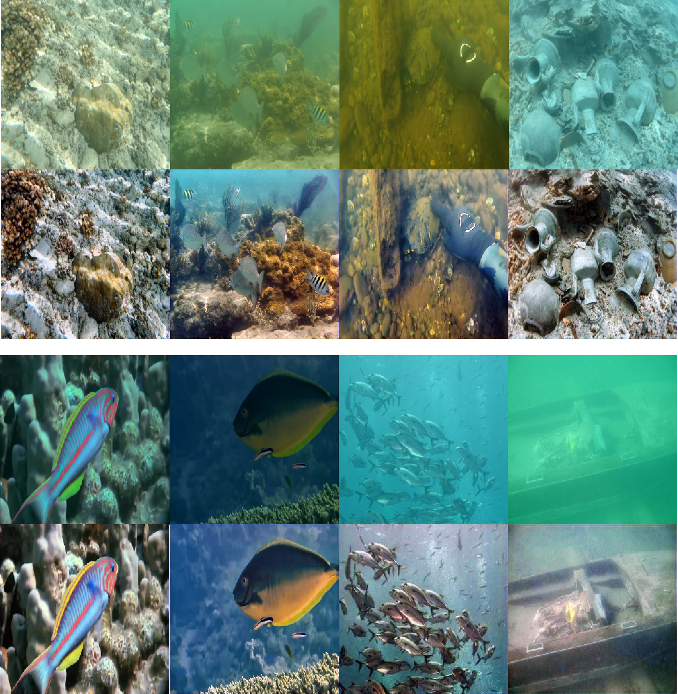

## Results of our method

## Introduction
This project is based on MMagic, an open-source tool from OpenMMLab. For details, please see https://github.com/open-mmlab/mmagic.

Here is the key code:

    .
    ├── ...
    ├── configs
    │   ├── SFW
    │   │   ├── sfw.py
    │   │   ├── test.py
    ├── ...
    ├── mmagic
    │   ├── models
    │   │   ├── __init__.py
    │   │   ├── base_models
    │   │   │   ├── base_uw_model.py
    │   │   ├── editors
    │   │   │   ├── SFW
    │   │   │   │   ├── sfw.py (The complete code will be provided after the paper is accepted.)
    │   │   │   │   ├── __init__.py
    │   │   │   ├── __init__.py
    │   │   ├── losses
    │   │   │   ├── perceptual_loss.py
    │   │   │   ├── pixelwise_loss.py
    │   │   │   ├── ssim_loss.py
    │   │   │   ├── __init__.py
    ├── ...
    └── ...
    

## Data

The dataset can be stored anywhere. During training, only the path in the config file needs to be modified; the same applies to testing.

## Training and Testing

Training and testing commands can be viewed at the MMagic’s documentation "https://mmagic.readthedocs.io/en/latest/".

